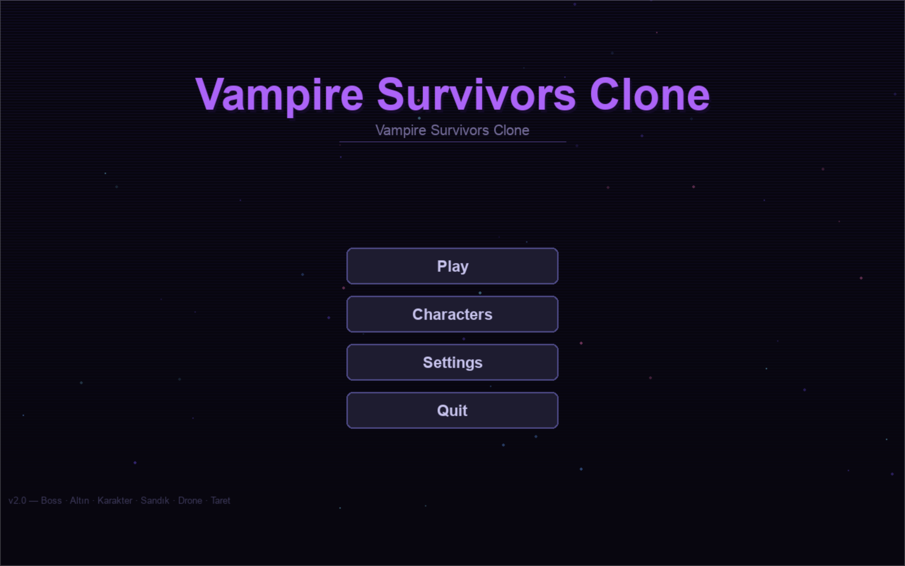
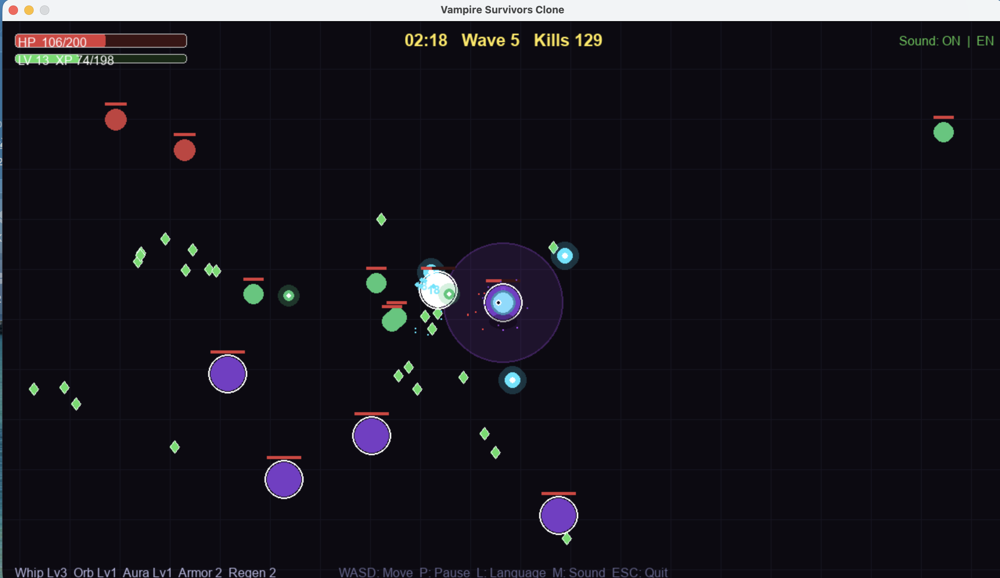
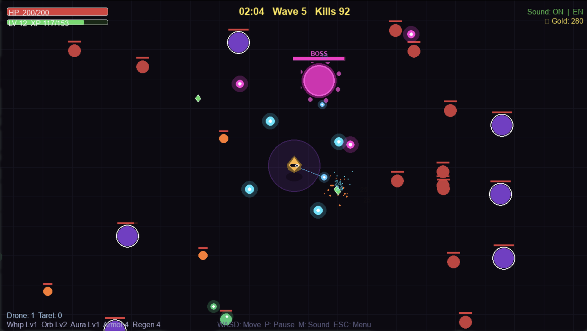

<p align="center">
  
</p>
🎮 Play & Download:
https://yagizkoryurek.itch.io/vampire-survivors-clone
⭐ Enjoyed the game? Leave a star on GitHub to support the project!

## Screenshots






⭐ Enjoyed the game? Leave a star on GitHub to support the project!
# 🧛 Vampire Survivors Clone

Fight hundreds of enemies, evolve powerful weapons and survive endless waves in this Vampire Survivors-inspired game built entirely with Python and Pygame.

---

## 🎮 Gameplay

Survive as long as possible against increasingly difficult enemy waves. Your weapons fire **automatically** — focus on moving, dodging, and choosing the right upgrades.


---

## ✨ Features

- Multiple Playable Characters
- Unique Character Stats
- Character Selection System
- Multiple Weapons & Upgrades
- XP & Leveling System
- Weapon Evolution
- Elite Enemies
- Boss Battles
- Treasure Chests
- Gold & Meta Progression
- Save System
- Endless Survival Gameplay

## 🖥️ Requirements

- Python 3.8+
- Pygame 2.x

---

## 🚀 Installation & Run

```bash
# 1. Clone the repository
git clone https://github.com/YOUR_USERNAME/vampire-survivors-clone.git
cd vampire-survivors-clone

# 2. Install dependencies
pip install -r requirements.txt

# 3. Run the game
python main.py
```

---

## 🎯 Controls

| Key | Action |
|-----|--------|
| `WASD` / Arrow Keys | Move |
| `P` | Pause / Resume |
| `1` / `2` / `3` | Select upgrade on level-up |
| `R` | Restart (after Game Over) |
| `ESC` | Quit |

---

## 🏆 How to Play

1. Move to avoid enemies — they always chase you
2. Your weapons fire automatically
3. Kill enemies → collect XP gems → level up → choose upgrades
4. Survive as long as possible — waves get harder every 30 seconds
5. Every 60 seconds, a **horde event** spawns a massive wave

---

## 📁 Project Structure

```
vampire-survivors-clone/
├── main.py          # Full game source (single-file architecture)
├── requirements.txt # Python dependencies
├── README.md        # This file
└── LICENSE          # MIT License
```

---

## 🛠️ Built With

- [Python](https://python.org) — Core language
- [Pygame](https://pygame.org) — Game framework

---

## 📜 License

MIT License — free to use, modify, and distribute.
